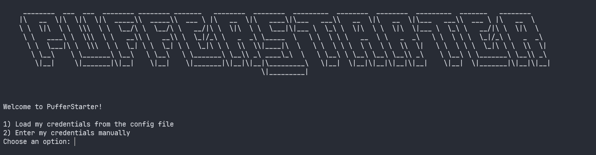
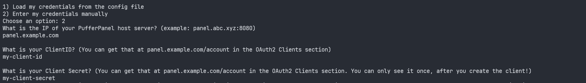
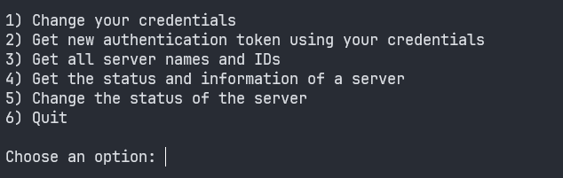
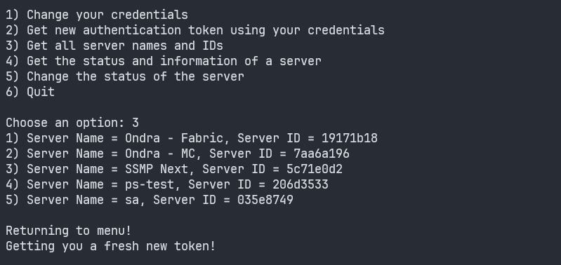
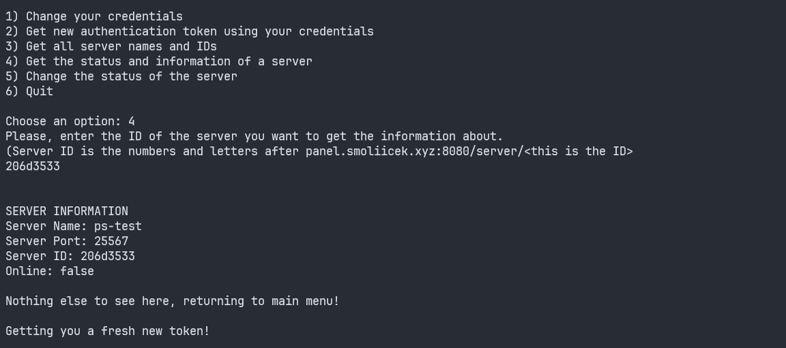
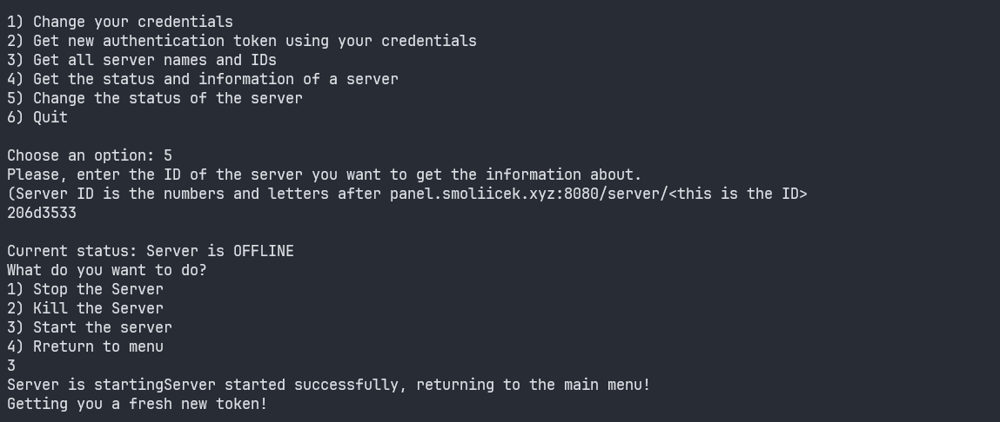
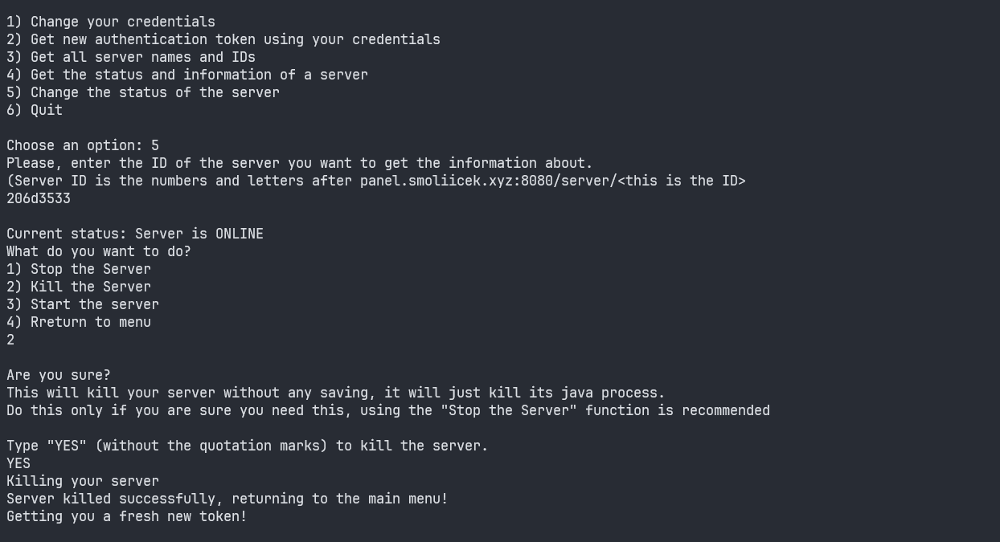

# Feature Tour

## Authentication menu

The authentication menu gives you the option to authenticate using your config file, or manually.

## Manual authentication

## Main menu

This is the main menu of the program.

## Getting and listing all of the servers

## Getting information about a server

## Changing the status of the server

## Killing the server
