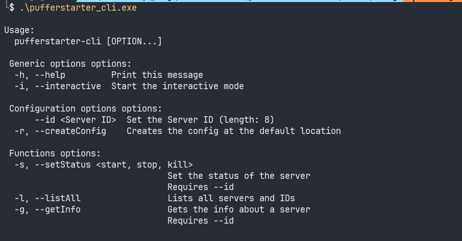
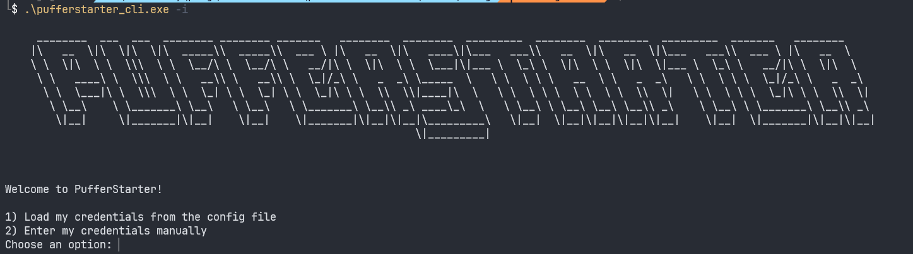
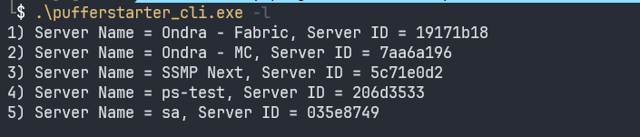
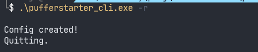
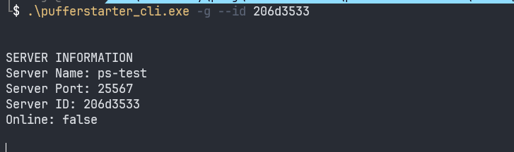
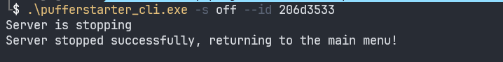

# Feature Tour - Non-Interactive mode

No arguments, or `--help, -h` argumment

`-i` argument, see [Feature Tour - Interactive mode](../Basics/FeatureTourInteractive.md)

`-l` option

`-r` option

`-g` option

`-s` options