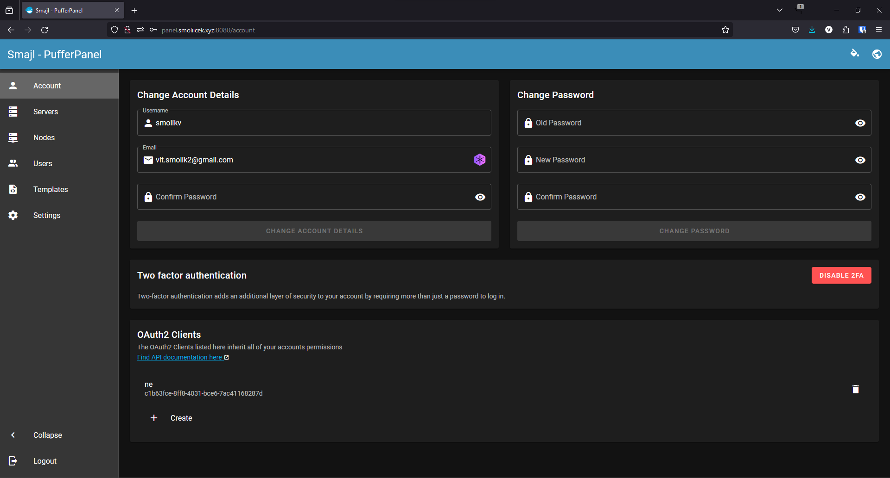
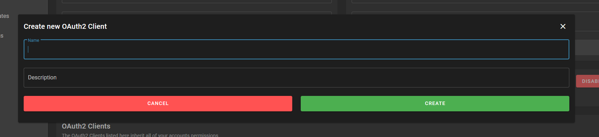
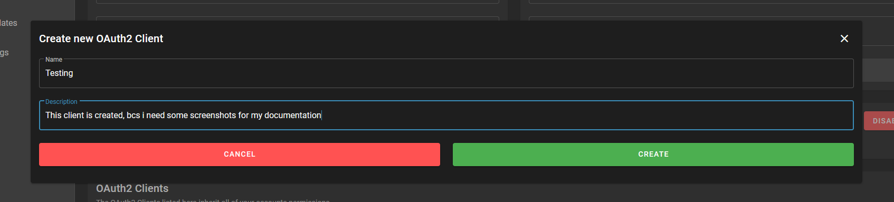
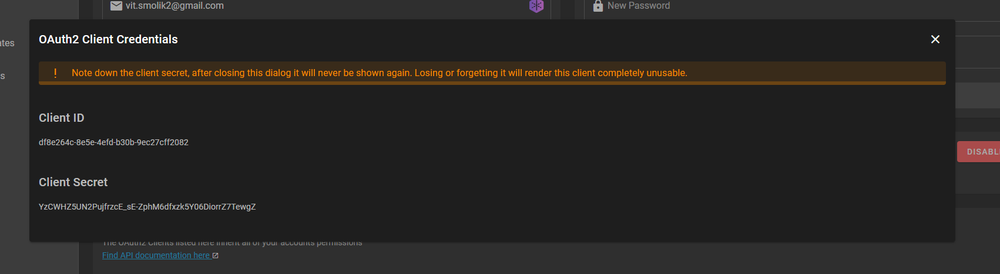

# Getting your OAuth2 Credentials
First log into your PufferPanel, using your email and password and head to the "Account" section:

Down in the "OAuth2 Clients" section, click on "Create"

Write the name, and some description about that client.

Then click Create.

A window like this will pop up, write down your Client ID and Client Secret, then press the X in the right hand corner.

You now created your own OAuth2 Credentials for use with PufferStarter!

### Where to continue?
Try [Configuring](configuration-file.md) PufferStarter, so you don't have to enter your credentials every time you start it!

